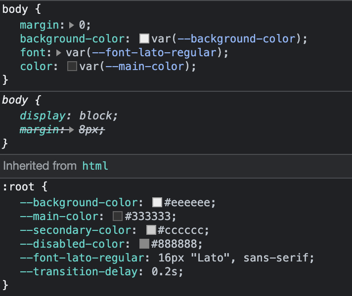

# How to use CSS variables with React

This article demonstrates usage of CSS variables in a simple React app. It won't be covering advanced use cases, but hopefully a simple and short explanation on how and when to use CSS variables.

Technologies used:
- React with TypeScript
- Plain CSS files imported to React
- CSS Variables

## Initial setup and configuration

1. Create a new React app with `npm create-react-app . --template typescript`
2. Start dev server using `npm start`

## Build initial app

Create initial application (without I added CSS variables). You can overwrite public/ and src/ folders with folders from [initial.zip](initial.zip)

## Intro to CSS variables

As your React applications grow, the code will be split into several files. Usually this makes handling things like CSS color codes and other values pretty hard.

Imagine you want to change all the ```#efefef``` to ```#e1e1e1``` - you can naturally make **find&replace** operation to your whole code base, but it is prone to error and you might end up changing some values you don't want to change.

Hence, it is way easier to define CSS variables in a single place and just to reference those later on. As a bonus, you can name your variables how you want so they make more sense semantically.

```css
/* declaration */
:root {
  -my-color: <value>;
}

/* usage */
body {
  color: var(--my-color);
}
```

**MORE INFO:** Using CSS custom properties (variables) on [MDN Web Docs](https://developer.mozilla.org/en-US/docs/Web/CSS/Using_CSS_custom_properties) and browser support in [caniuse.com](https://caniuse.com/css-variables)

## Convert code to use CSS variables

First we need to add our CSS variables into [src/index.css](index.css) file.

```css
:root {
  --background-color: #eeeeee;
  --main-color: #333333;
  --secondary-color: #cccccc;
  --disabled-color: #888888;
  --font-lato-regular: 16px "Lato", sans-serif;
  --transition-delay: 0.2s;
}
```

**ADVANCED:** in some 3rd party libraries, like [StyledComponents](https://styled-components.com/docs/api#createglobalstyle) you might not need to change (or have at all) index.css. There is often a way to create "global stylesheet" that can be themed properly.

After adding variables, it is time to replace old fixed CSS values with references to the new variables.

```css
/* you can replace existing css like  this */
color: #333333;
transition: background-color 0.2s;

/* with something like this */
color: var(---main-color);
transition: background-color var(---transition-delay);

/* etc, etc, etc */
```

**NOTE:** I didn't change all the color codes into variables, but it could be done as well.

**NOTE:** Remember, you can store pretty much anything into variables as long as it is a valid CSS value.

You can also take a look of [GIT commit](https://github.com/kallelat/blog-react-css-variables/commit/06273f390575f1f0d556fa8aa2afc4fc635106c8) including all the changes.

## Summary

CSS variables provide a simple way to organize commonly used CSS values into a global collection of variables. This improves your code and especially in the bigger projects this can be a big help.

It works pretty well with React using plain CSS files, but I would imagine it works as fine with [CSS Modules](https://github.com/css-modules/css-modules) and libraries like [StyledComponents](https://styled-components.com/).

Browser inspectors (at least in Chrome) shows reference to the variable instead of the actual value. Not a big deal but takes a while to get used to.



**Feel free to browse the code, if you have any questions or improvement ideas let me know!**

## Author

Timo Kallela, for more information please visit my [GitHub profile](https://github.com/kallelat)

You can also contact me by [email](mailto:timo.kallela@gmail.com) or via [LinkedIn](https://www.linkedin.com/in/kallelat/)!

## License

Contents of this repository is licensed under [MIT](LICENSE) license.
